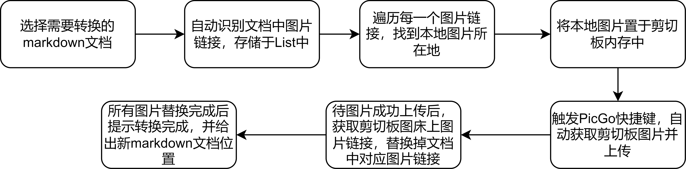

# AutoMDTrans

Auto MarkDown Transformation

本项目自动识别markdown文档中图片，将其自动上传到图床（需结合PicGo使用），并自动替换原图片链接为图床上图片链接。

# 项目流程图



# 使用事项

- 需要安装PicGo，可参考我的[博客](https://blog.csdn.net/qq_32614873/article/details/126286121?csdn_share_tail=%7B%22type%22%3A%22blog%22%2C%22rType%22%3A%22article%22%2C%22rId%22%3A%22126286121%22%2C%22source%22%3A%22qq_32614873%22%7D&ctrtid=m1dMr)
- 需要安装requirement.txt里面的环境，安装命令
  ```
  pip install -r requirement.txt
  ```

现在运行会出现如下错误：

```bash
ImportError: cannot import name 'PyKeyboard' from 'pykeyboard'
```

找到pykeyboard的安装路径，将`__init__.py`文件替换为如下内容：

```bash
import sys
 
if sys.platform.startswith('java'):
    from .java_ import PyKeyboard
 
elif sys.platform == 'darwin':
    from .mac import PyKeyboard, PyKeyboardEvent
 
elif sys.platform == 'win32':
    from .windows import PyKeyboard, PyKeyboardEvent
 
else:
    from .x11 import PyKeyboard, PyKeyboardEvent
```

此错误更详细介绍见这篇博客：[安装pykeyboard模块 ](https://www.cnblogs.com/Anec/p/14644939.html)

- 使用
  ```
  python main.py --file_path "your_markdown_path"
  ```

# TO DO

* [ ] 解决上传失败死循环问题
* [ ] 新文档重命名
* [ ] html格式图片识别
